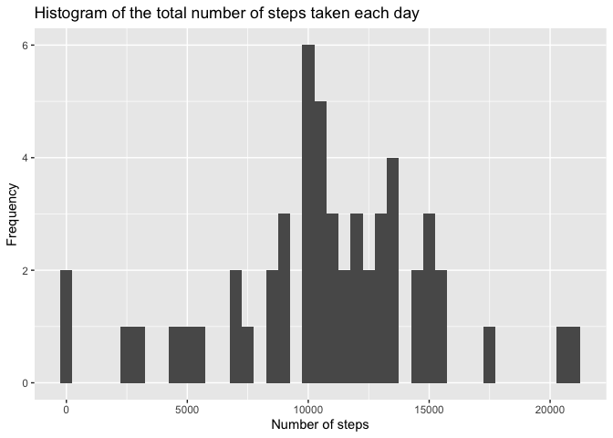
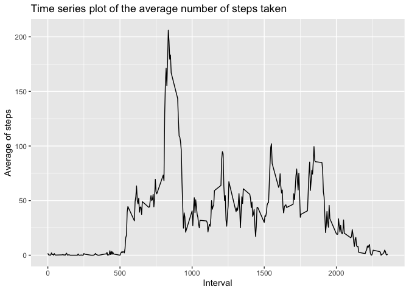
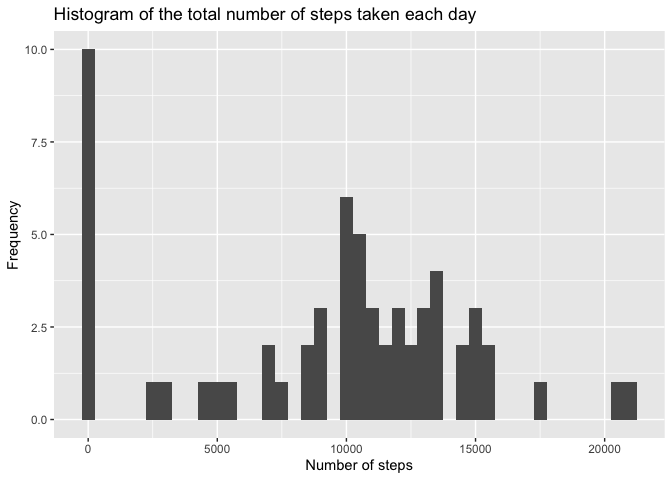
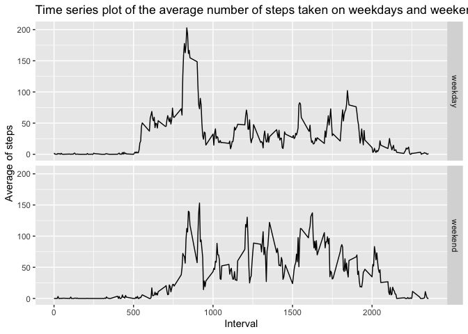

## Loading and preprocessing the data

#### Code for libraries and dataset import

```r
#creating a function which checks for needed packages and downloads/import them if needed
dl_and_import_libraries <- function(packages){
  installed_packages <- packages %in% rownames(installed.packages())
  if (any(installed_packages == FALSE)) {
    install.packages(packages[!installed_packages])
  }
  invisible(lapply(packages, library, character.only = TRUE))
}
must_have_libs <- c("ggplot2", "Hmisc")
#calling said function
dl_and_import_libraries(must_have_libs)

#unzipping and importing dataset
unzip(zipfile = "activity.zip")
raw_activity_dataset <- read.csv("activity.csv")
```


## What is mean total number of steps taken per day?

#### Code and output for the histogram of the total number of steps taken each day

```r
#Aggregating (sum) interval-steps into day-steps 
day_sum_aggregate_activity_dataset <- aggregate(steps ~ date, raw_activity_dataset, sum, na.rm=TRUE)
#plotting histogram of number of steps and frequency
ggplot(data = day_sum_aggregate_activity_dataset, aes(x = steps)) +
  ggtitle("Histogram of the total number of steps taken each day") +
  xlab("Number of steps") +
  ylab("Frequency") +
  geom_histogram(binwidth = 500)
```

<!-- -->

#### Code to calculate and display the mean and median number of steps taken each day

```r
#Aggregating (sum) interval-steps into day-steps 
day_sum_aggregate_activity_dataset <- aggregate(steps ~ date, raw_activity_dataset, sum, na.rm = TRUE)
#performing mean and median
steps_mean <- mean(day_sum_aggregate_activity_dataset$steps)
steps_median <- median(day_sum_aggregate_activity_dataset$steps)
```


```r
#displaying mean
steps_mean
```

```
## [1] 10766.19
```


```r
#displaying median
steps_median
```

```
## [1] 10765
```


## What is the average daily activity pattern?

#### Code and plot of time series plot of the average number of steps taken

```r
#Aggregating (mean) interval-steps into day-steps 
day_mean_aggregate_activity_dataset <- aggregate(steps ~ interval, raw_activity_dataset, mean, na.rm = TRUE)
#plotting the time series data
ggplot(data = day_mean_aggregate_activity_dataset, aes(x = interval, y = steps)) +
  ggtitle("Time series plot of the average number of steps taken") +
  xlab("Interval") +
  ylab("Average of steps") +
  geom_line()
```

<!-- -->

#### Code to calculate and display the 5-minute interval that, on average, contains the maximum number of steps

```r
#getting maximum value for steps taken in an interval
max_steps_mean <- max(day_mean_aggregate_activity_dataset$steps)
#accessing to the interval related to that max value and storing it into a variable
interval_with_highest_steps_mean <- subset(day_mean_aggregate_activity_dataset, day_mean_aggregate_activity_dataset$steps == max_steps_mean)$interval
```


```r
#printing interval with highest value of steps
interval_with_highest_steps_mean
```

```
## [1] 835
```


## Imputing missing values

#### Code to describe and show a strategy for imputing missing data

```r
#calculate the amount of NA values
na_amount <- length(which(is.na(raw_activity_dataset$steps)))
```


```r
#displaying the amount of NA values
na_amount
```

```
## [1] 2304
```


```r
#imputing NA values in the dataset by calculating mean values in intervals
imputed_na_activity_dataset <- raw_activity_dataset
imputed_na_activity_dataset$steps <- impute(raw_activity_dataset$steps, FUN = mean)
imputed_na_day_sum_aggregate_activity_dataset <- aggregate(steps ~ date, imputed_na_activity_dataset, sum, na.rm=TRUE)
```

#### Code and output for the histogram of the total number of steps taken each day.

```r
ggplot(data = imputed_na_day_sum_aggregate_activity_dataset, aes(x = steps)) +
  ggtitle("Histogram of the total number of steps taken each day") +
  xlab("Number of steps") +
  ylab("Frequency") +
  geom_histogram(binwidth = 500)
```

<!-- -->

#### Code to calculate and display the mean and median total number of steps taken per day

```r
#Code to calculate the mean and median total number of steps taken per day
imputed_na_avg_steps <- mean(imputed_na_day_sum_aggregate_activity_dataset$steps)
imputed_na_median_steps <- median(imputed_na_day_sum_aggregate_activity_dataset$steps)
```


```r
#Display the mean and median total number of steps taken per day
imputed_na_avg_steps
```

```
## [1] 9354.23
```

```r
imputed_na_median_steps
```

```
## [1] 10395
```


## Are there differences in activity patterns between weekdays and weekends?

#### Panel plot comparing the average number of steps taken per 5-minute interval across weekdays and weekends

```r
imputed_na_activity_dataset$day_of_week <-  ifelse(as.POSIXlt(imputed_na_activity_dataset$date)$wday %in% c(0,6), 'weekend', 'weekday')
imputed_na_day_mean_aggregate_activity_dataset <- aggregate(steps ~ interval + day_of_week, data=imputed_na_activity_dataset, mean)
ggplot(data = imputed_na_day_mean_aggregate_activity_dataset, aes(x = interval, y = steps)) +
  ggtitle("Time series plot of the average number of steps taken on weekdays and weekends") +
  facet_grid(day_of_week ~ .) +
  xlab("Interval") +
  ylab("Average of steps") +
  geom_line()
```

<!-- -->

